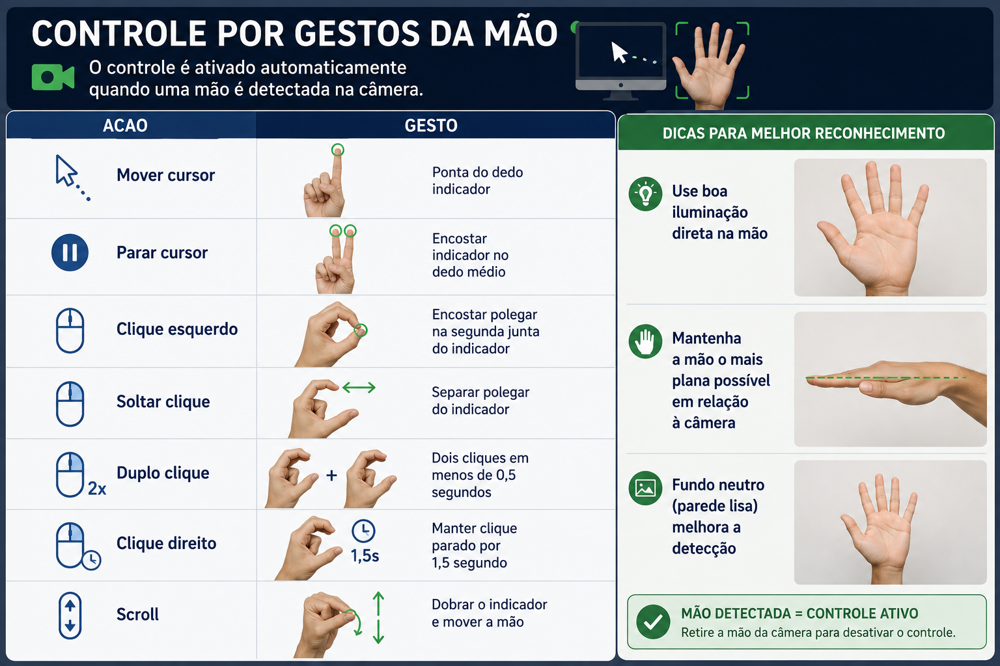

# NonMouse

Aplicação que permite usar a mão como mouse, utilizando a webcam para reconhecer gestos e controlar o cursor.

---

## Requisitos

- **Python 3.12.9** (testado e validado no Windows 11)
- Webcam USB ou integrada
- Windows 10/11

> **Nota sobre Python 3.14:** o pacote `mediapipe` ainda não tem suporte oficial para Python 3.14. Use Python 3.12.9 com o `python` no PATH conforme instruído abaixo.
>
> Baixe sempre o **Windows installer (64-bit)** em https://www.python.org/downloads/release/python-3129/ — nunca o embeddable package.

---

## Estrutura do projeto

```
webcam-cursor/
├── nonmouse/               # pacote principal
│   ├── __init__.py
│   ├── camera.py           # abertura de camera com fallback de backend
│   ├── detector.py         # deteccao de mao via mediapipe
│   ├── gesture.py          # logica de controle do mouse por gestos
│   ├── drawing.py          # desenho de landmarks e feedback visual
│   └── screen.py           # resolucao virtual de multiplos monitores
├── docs/
│   └── dicas.png           # guia visual de gestos
├── models/
│   └── hand_landmarker.task  # modelo mediapipe (baixado automaticamente)
├── examples/               # exemplos com diferentes bibliotecas de captura
│   ├── example_opencv.py   # OpenCV com fallback de backend (padrao)
│   ├── example_pygrabber.py # DirectShow nativo via COM (sem OpenCV)
│   ├── example_pyav.py     # FFmpeg via PyAV
│   ├── example_vidgear.py  # vidgear CamGear (threading embutido)
│   ├── example_imageio.py  # imageio + imageio-ffmpeg
│   └── README.md           # comparativo e instrucoes
├── test/
│   ├── teste.py              # teste basico OpenCV
│   ├── teste-cuda.py         # teste de suporte CUDA
│   ├── teste-pygrabber.py    # teste captura DirectShow nativo
│   ├── teste-pyav.py         # teste captura FFmpeg/PyAV
│   ├── teste-vidgear.py      # teste captura vidgear
│   └── teste-imageio.py      # teste captura imageio + ffmpeg
├── app.py                  # modo principal com interface grafica
├── tv_mouse.py             # modo otimizado via linha de comando
├── list_camera.py          # utilitario para listar cameras
├── requirements.txt
├── install.bat
└── README.md
```

---

## Instalação

### 1. Clone o repositório

```sh
git clone https://github.com/takeyamayuki/NonMouse
cd NonMouse
```

### 2. Instale as dependências

```sh
python -m pip install --no-cache-dir -r requirements.txt
```

> **Dica:** se aparecer erro `IncompleteRead` ou `Connection broken`, use o script `install.bat`:
> ```sh
> install.bat
> ```

O modelo de detecção de mão (`models/hand_landmarker.task`) é baixado automaticamente na primeira execução.

---

## Verificar câmeras disponíveis

Antes de rodar o app, execute o utilitário de listagem para descobrir quais índices de câmera estão disponíveis:

```sh
python list_camera.py
```

Saída esperada:

```
Idx   Backend  Resolucao    FPS
-----------------------------------
0     DSHOW    640x480      N/A
1     DSHOW    640x480      N/A
```

- **Idx** — número a usar na seleção de câmera (`Device0`, `Device1`, etc.)
- **Backend** — driver usado pelo OpenCV (`DSHOW` é o padrão no Windows)
- **FPS N/A** — normal em alguns drivers; o app mede o FPS em tempo real

---

## Como executar

### Modo principal — `app.py` (com interface gráfica)

```sh
python app.py
```

Uma janela de configuração será exibida antes de iniciar:

| Campo | O que fazer |
|---|---|
| **Camera** | Selecione `Device0` ou `Device1` conforme o resultado do `list_camera.py` |
| **How to place** | Escolha a posição da câmera (veja abaixo) |
| **Sensitivity** | Ajuste a sensibilidade do cursor (padrão 30 — valores altos causam tremor) |

Clique em **Continue** para iniciar o reconhecimento.

**Opções de posicionamento da câmera:**

| Opção | Descrição |
|---|---|
| `Normal` | Câmera apontada para você — posição padrão de webcam de mesa |
| `Above` | Câmera posicionada acima da mão, apontada para baixo |
| `Behind` | Câmera atrás de você, apontada para o monitor |

---

### Modo otimizado — `tv_mouse.py` (sem interface gráfica, mais rápido)

Indicado para uso contínuo ou em máquinas com menos recursos:

```sh
python tv_mouse.py
```

**Argumentos disponíveis:**

| Argumento | Padrão | Descrição |
|---|---|---|
| `--camera 0` | `0` | Índice da câmera (use o valor do `list_camera.py`) |
| `--kando 30` | `30.0` | Sensibilidade do movimento do cursor |
| `--headless` | desativado | Desativa a janela de vídeo (roda só em background) |

**Exemplos:**

```sh
# Câmera 1, sensibilidade 20
python tv_mouse.py --camera 1 --kando 20

# Sem janela de vídeo (modo silencioso)
python tv_mouse.py --headless

# Câmera 1, sem janela, sensibilidade alta
python tv_mouse.py --camera 1 --kando 40 --headless
```

---

## Gestos da mão

O controle é ativado automaticamente quando uma mão é detectada na câmera.



| Acao | Gesto |
|---|---|
| **Mover cursor** | Ponta do dedo indicador |
| **Parar cursor** | Encostar indicador no dedo médio |
| **Clique esquerdo** | Encostar polegar na segunda junta do indicador |
| **Soltar clique** | Separar polegar do indicador |
| **Duplo clique** | Dois cliques em menos de 0,5 segundos |
| **Clique direito** | Manter clique parado por 1,5 segundo |
| **Scroll** | Dobrar o indicador e mover a mão |

**Dicas para melhor reconhecimento:**
- Use boa iluminação direta na mão
- Mantenha a mão o mais plana possível em relação à câmera
- Fundo neutro (parede lisa) melhora a detecção

---

## Encerrar

| Situacao | Como encerrar |
|---|---|
| Terminal ativo | `Ctrl+C` |
| Janela do app aberta | Tecla `Esc` ou botão fechar |

---

## Solucao de problemas de webcam

Se a câmera não abrir ou travar, siga os passos:

**1. Liste as câmeras disponíveis:**
```sh
python list_camera.py
```

**2. Tente o índice alternativo:**
```sh
# app.py: selecione Device1 na tela de configuração

# tv_mouse.py:
python tv_mouse.py --camera 1
```

**3. Verifique no Windows 11:**
- Configurações → Privacidade e segurança → Câmera → permitir acesso para aplicativos de desktop
- Gerenciador de Dispositivos → Câmeras → verificar se o driver está instalado sem erros

**4. Teste básico da câmera:**
```sh
# OpenCV (padrao)
python test/teste.py

# pygrabber — DirectShow nativo
python test/teste-pygrabber.py

# PyAV — FFmpeg
python test/teste-pyav.py

# vidgear
python test/teste-vidgear.py

# imageio + ffmpeg
python test/teste-imageio.py
```

Todos os testes aceitam o indice da camera como argumento:
```sh
python test/teste.py 1
```

---

## Exemplos alternativos de captura

A pasta `examples/` contém implementações do mesmo pipeline usando diferentes bibliotecas de captura de webcam. Útil para entender as alternativas ao OpenCV ou para adaptar o projeto a outros ambientes.

```sh
# OpenCV com fallback automatico (padrao do projeto)
python examples/example_opencv.py

# DirectShow nativo via COM — sem depender do OpenCV para captura
python examples/example_pygrabber.py

# FFmpeg via PyAV — controle total sobre codec e formato
python examples/example_pyav.py

# vidgear — API simples com threading embutido
python examples/example_vidgear.py

# imageio + ffmpeg
python examples/example_imageio.py
```

Consulte [`examples/README.md`](examples/README.md) para o comparativo completo entre as abordagens.

---

## Build (opcional)

Para gerar um executável `.exe` standalone no Windows:

```sh
python -m pip show mediapipe
# Copie o caminho em "Location" para o campo datas no arquivo app-win.spec

python -m PyInstaller app-win.spec
```

O executável gerado estará na pasta `dist/`.

---

## Historico de problemas e correcoes

Registro dos problemas encontrados no projeto original e as solucoes aplicadas.

### 1. `requirements.txt` com pacote invalido

**Problema:** o arquivo continha `opencv-pythonmacbook`, que e um pacote inexistente no PyPI, alem de `av`, `imageio` e `imageio-ffmpeg` desnecessarios para o app.

**Solucao:** substituido por `opencv-python>=5.0.0` e removidos os pacotes nao utilizados.

---

### 2. mediapipe sem suporte para Python 3.14

**Problema:** o projeto foi solicitado para rodar em Python 3.14, porem o pacote `mediapipe` nao tem suporte oficial para essa versao.

**Solucao:** fixado em **Python 3.12.9** (instalador oficial `python-3.12.9-amd64.exe`), que e totalmente suportado pelo `mediapipe 1.0.1`.

> Atencao: nao use o **Windows embeddable package** (arquivo `.zip`). Ele nao inclui `pip`, `venv` nem `ensurepip`. Baixe sempre o **Windows installer (64-bit)** em https://www.python.org/downloads/release/python-3129/

---

### 3. Deteccao de webcam sem fallback de backend

**Problema:** `app.py` abria a camera com `cv2.VideoCapture(index)` sem especificar backend, causando tela preta silenciosa em algumas configuracoes do Windows 11. `tv_mouse.py` usava `CAP_MSMF` fixo sem alternativa. `list_camera.py` testava apenas `CAP_DSHOW`.

**Solucao:** implementada funcao `open_camera()` em `nonmouse/camera.py` que tenta os backends `DSHOW → MSMF → ANY` automaticamente ate obter um frame valido. `list_cameras()` tambem testa os tres backends.

---

### 4. Crash e tela preta por frames invalidos

**Problema:** o loop principal nao verificava se o frame era valido antes de processar. Em alguns drivers do Windows 11, `isOpened()` retorna `True` e `read()` retorna `success=True` mas o frame e `None` ou preto. Alem disso, havia race condition na `ThreadedCamera` onde `grabbed=True` mas `frame` ainda era `None`.

**Solucao:** adicionado guard `if not ok or frame is None` em todos os pontos de leitura. `ThreadedCamera.read()` verifica ambos `grabbed` e `frame` antes de retornar.

---

### 5. Erro `IncompleteRead` ao instalar dependencias

**Problema:** `pip install -r requirements.txt` falhava com `Connection broken: IncompleteRead` devido a cache corrompido do pip.

**Solucao:** usar sempre a flag `--no-cache-dir` na instalacao. O script `install.bat` ja inclui essa flag automaticamente.

```sh
python -m pip install --no-cache-dir -r requirements.txt
```

---

### 6. `.venv` do PyCharm criado com Python embeddable

**Problema:** o Python 3.12.9 no PATH era a versao embeddable (arquivo `.zip` extraido), que nao suporta `venv`, `pip` nem `ensurepip`. O PyCharm criava o `.venv` a partir dele e o `pip.exe` do venv crashava com erro de DLL.

**Solucao:** desinstalar o embeddable, instalar o Python 3.12.9 via instalador oficial `.exe` com as opcoes **Add to PATH** e **Install pip** marcadas, e recriar o `.venv` pelo PyCharm.

---

### 7. Codigo monolitico sem separacao de responsabilidades

**Problema:** toda a logica de camera, deteccao, gestos, desenho e tela estava misturada em `app.py` e `tv_mouse.py`, com codigo duplicado entre os dois arquivos.

**Solucao:** refatorado em pacote `nonmouse/` com modulos de responsabilidade unica:

| Modulo | Responsabilidade |
|---|---|
| `camera.py` | abertura de camera com fallback, captura em thread |
| `detector.py` | deteccao de mao via mediapipe, download do modelo |
| `gesture.py` | traducao de landmarks em acoes de mouse |
| `drawing.py` | feedback visual na imagem |
| `screen.py` | resolucao virtual de multiplos monitores |

---

## Licenca

Veja o arquivo [LICENSE](LICENSE).
